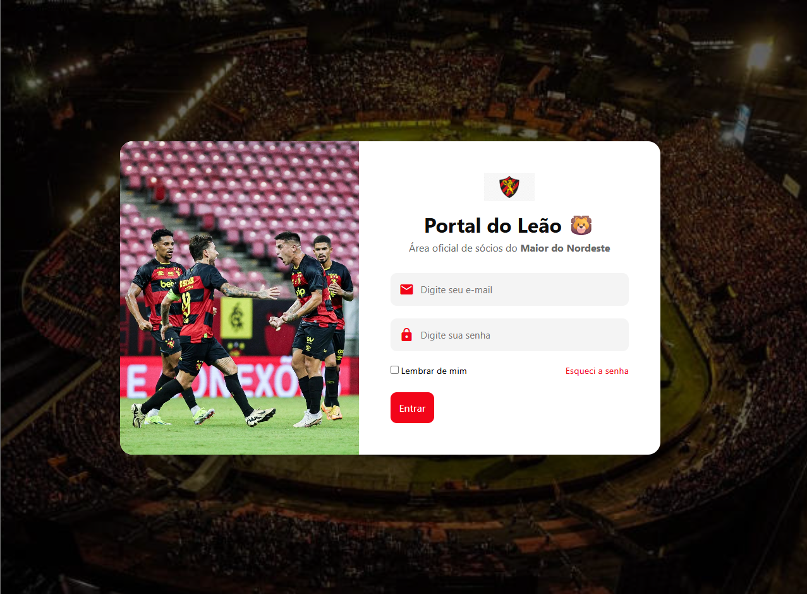

# 🔐 Tela de Login – Portal Web (Mobile First)

Projeto de **Tela de Login responsiva**, desenvolvido com **HTML5 e CSS3**, focado na abordagem **Mobile First** e em boas práticas de experiência do usuário.

A aplicação simula o fluxo de autenticação de um portal, realizando **validações de campos obrigatórios** e redirecionando o usuário para uma nova página após o preenchimento correto dos dados.
---

## 🌐 Deploy do Projeto

🔗 Acesse o projeto online:  
https://develyshow.github.io/Projeto-Tela-de-Login/

---

## 📸 Preview do Projeto



---

## 🚀 Funcionalidades

- Layout responsivo seguindo o conceito **Mobile First**
- Dois campos de formulário:
  - Usuário / E-mail
  - Senha
- Validação de campos obrigatórios
- Exibição de mensagens de erro quando:
  - Um ou mais campos não são preenchidos
- Submissão via método **GET**
- Redirecionamento para uma nova página após validação dos dados
- Interface simples, limpa e intuitiva

---

## 🎯 Objetivo do Projeto

Este projeto foi desenvolvido com o objetivo de praticar:

- Estruturação semântica com **HTML5**
- Estilização e responsividade com **CSS3**
- Conceito de **Mobile First**
- Criação de formulários acessíveis
- Validação básica de dados do usuário
- Organização de layout para aplicações web

---

## 🛠️ Tecnologias Utilizadas

- **HTML5**
- **CSS3**
- **Mobile First Design**
- **Git & GitHub**

---

## 📱 Mobile First

O layout foi pensado inicialmente para dispositivos móveis, garantindo:
- Boa usabilidade em telas menores
- Escalabilidade para tablets e desktops
- Melhor experiência do usuário desde o primeiro acesso

---

## 📂 Estrutura do Projeto

```bash
.
├── src/
│   ├── assets/
│   │   └── img/
│   │       └── preview.png
│   ├── css/
│   │   └── style.css
│   ├── login.html
│   └── dashboard.html
└── README.md
